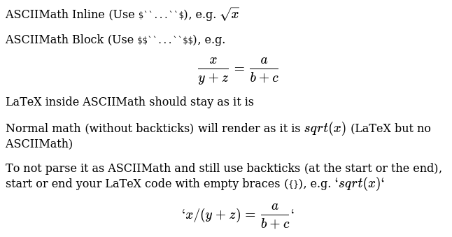

# rehype-asciimath

[ASCIIMath](http://asciimath.org/) plugin for [Rehype](https://github.com/rehypejs/rehype)

To be used in conjunction with Katex or MathJAX

This uses the `ASCIIMathTeXImg.js` from the ASCIIMath repo with a [patch which is yet to be merged](https://github.com/asciimath/asciimathml/pull/118)

## Example markdown

Wrap your code in backticks (`` ` ``) inside the dollars (`$`) for rendering the block using ASCIIMath

```plain
ASCIIMath Inline (Use $`...`$), e.g. $`sqrt(x)`$

ASCIIMath Block (Use $$`...`$$), e.g.

$$
`x / (y+z) = \frac{a}{b+c}`
$$

LaTeX inside ASCIIMath should stay as it is

Normal math (without backticks) will render as it is $sqrt(x)$ (LaTeX but no ASCIIMath)

To not parse it as ASCIIMath and still use backticks (at the start or the end), start or end your LaTeX code with empty braces (`{}`), e.g. $`sqrt(x)`{}$

$$
{}`x / (y+z) = \frac{a}{b+c}`
$$
```

Renders as:



## Usage

- Add this plugin to your dependencies `npm i -s rehype-asciimath`
- Add the [`remark-math`](https://github.com/remarkjs/remark-math/tree/main/packages/remark-math) and [`rehype-katex`](https://github.com/remarkjs/remark-math/tree/main/packages/rehype-katex) (or [rehype-mathjax](https://github.com/remarkjs/remark-math/tree/main/packages/rehype-mathjax)) plugins to your dependencies
- Use the `rehype-asciimath` plugin before the `rehype-katex` plugin
- Example config

```js
const remarkMath = require("remark-math");
const rehypeASCIIMath = require("rehype-asciimath");
const rehypeKatex = require("rehype-katex");

const config = {
    remarkPlugins: [remarkMath],
    rehypePlugins: [
        rehypeAsciiMath,
        rehypeKatex,
    ]
}
```

## License

The MIT License https://meghprkh.mit-license.org/

Copyright © 2020 Megh Parikh meghprkh@gmail.com
